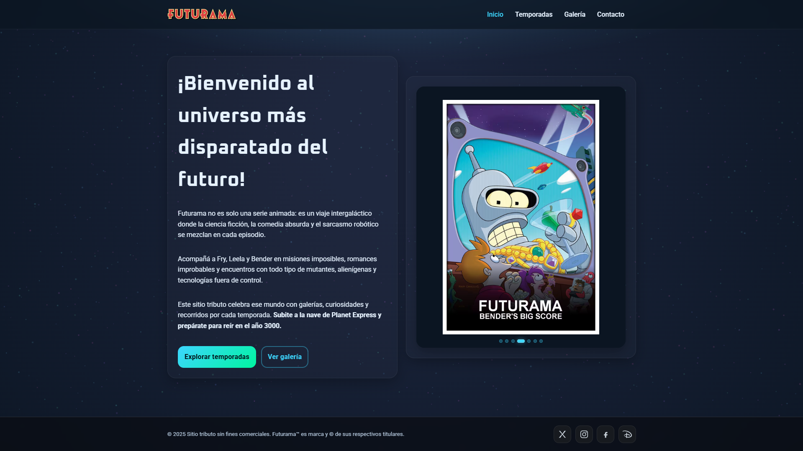
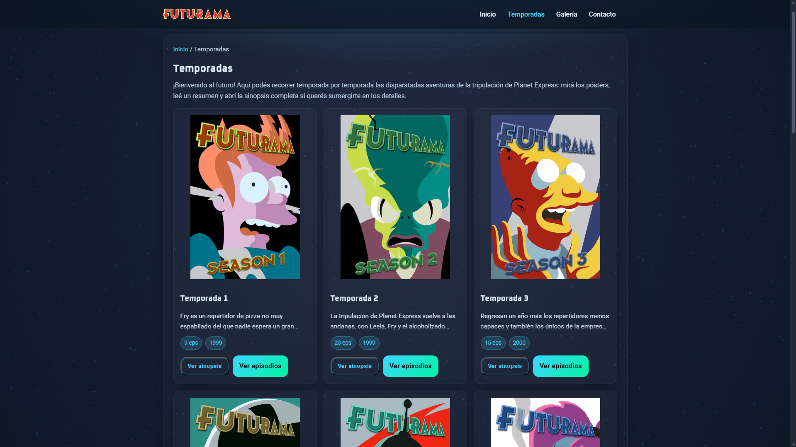
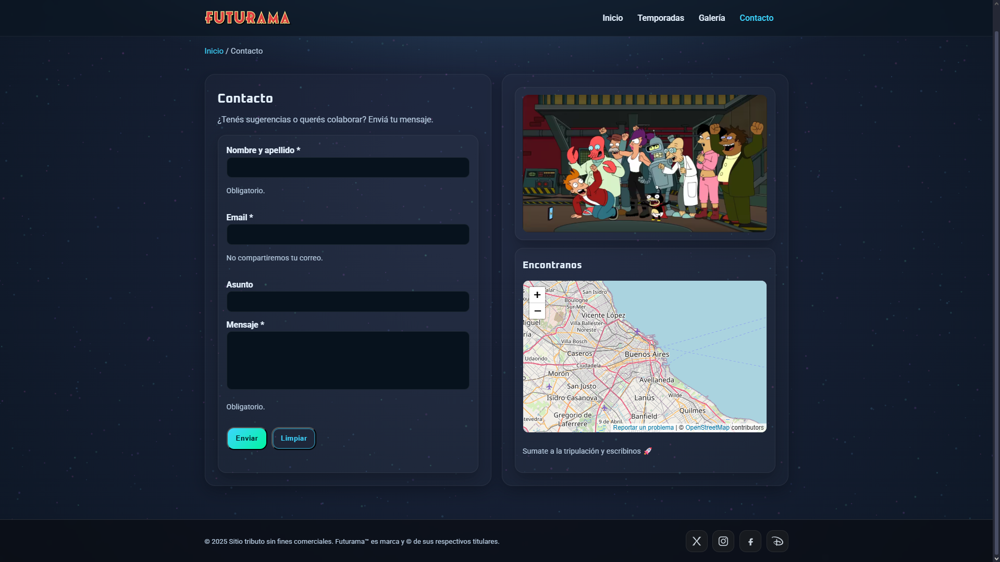
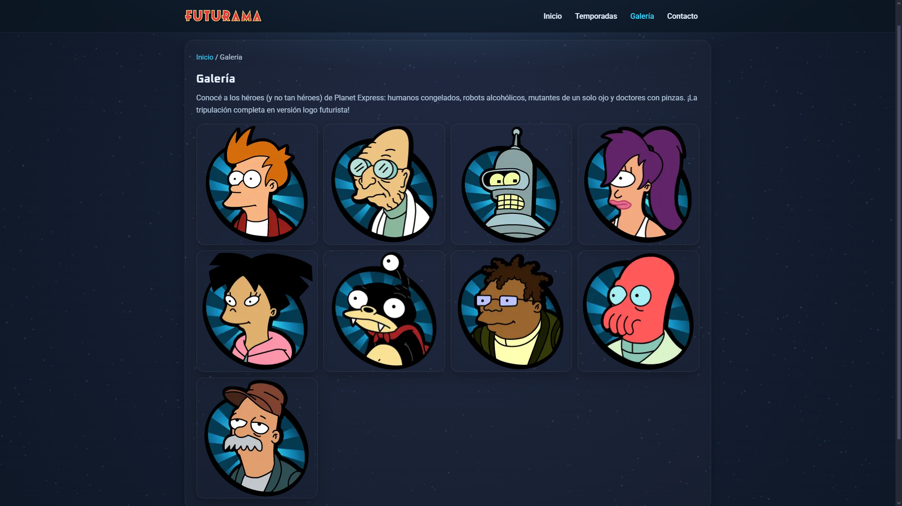
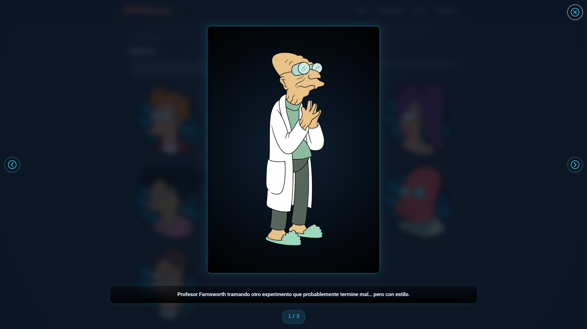

<!-- LOGO DEL PROYECTO -->
<p align="center">
  
</p>

<h1 align="center">🌌 Fan Site</h1>
<p align="center">
  Un sitio web temático sobre <strong>Futurama</strong>, con galerías, temporadas, personajes y efectos visuales 🚀
</p>

---

## 📑 Índice
- [✨ Características](#-características)
- [📂 Estructura del Proyecto](#-estructura-del-proyecto)
- [🛠️ Tecnologías](#️-tecnologías)
- [🚀 Instalación y Uso](#-instalación-y-uso)
- [📸 Capturas](#-capturas)
- [🌐 Demo](#-demo)

---

## ✨ Características
✔️ **Diseño responsive** con HTML5 + CSS Grid/Flexbox  
✔️ **Accesibilidad (A11y)**: navegación por teclado, aria-labels, focus-trap, `prefers-reduced-motion`  
✔️ **Optimización de imágenes**: AVIF/WebP, lazy loading, starfield animado  
✔️ **Componentes dinámicos**:
- Hero con carrusel automático  
- Galería con lightbox y autoplay  
- Temporadas cargadas desde JSON con modales accesibles  
- Formulario de contacto con validación y feedback en modal  
✔️ **Estilo retro-futurista** inspirado en el universo de Futurama  

---

## 📂 Estructura del Proyecto
```
futurama-site/
├── index.html           # Página principal (hero + navegación)
├── galeria.html         # Galería dinámica de imágenes
├── temporadas.html      # Listado de temporadas y episodios
├── contacto.html        # Formulario de contacto
├── 404.html             # Página de error
│
├── css/
│   └── estilos.css      # Estilos globales y componentes
│
├── js/
│   ├── main.js          # Navegación y menú accesible
│   ├── hero-carousel.js # Carrusel hero autoplay
│   ├── gallery.js       # Galería + Lightbox
│   ├── seasons.js       # Temporadas + Modales
│   ├── contact.js       # Validaciones del formulario
│   └── spacefx.js       # Fondo animado con estrellas
│
├── data/
│   ├── galeria.json     # Datos de imágenes de personajes
│   └── temporadas.json  # Datos de temporadas
│
├── img/                 # Imágenes en AVIF/WebP
└── .vscode/             # Configuración opcional del editor
```

---

## 🛠️ Tecnologías
- **HTML5** → estructura semántica y accesible  
- **CSS3** → diseño responsive, variables, animaciones  
- **JavaScript (Vanilla)** → interactividad modular  
- **JSON** → almacenamiento de datos (galerías, temporadas)  
- **AVIF/WebP** → formatos de imagen optimizados  

---

## 🚀 Instalación y Uso

1. Clonar el repositorio  
   ```bash
   git clone https://github.com/usuario/futurama-site.git
   cd futurama-site
   ```

2. Abrir `index.html` en tu navegador  
   > No requiere servidor, es un sitio **100% estático**.  

3. (Opcional) Montar un servidor local con VSCode Live Server o similar.  
   ```bash
   npx serve .
   ```

---

## 📸 Capturas

### 🏠 Página de inicio


### 📺 Temporadas


### 📬 Contacto


### 👥 Galería


### 🔍 Lightbox de personajes


---

## 🌐 Demo
👉 [Enlace al sitio en GitHub Pages](https://usuario.github.io/futurama-site) *(ejemplo, ajustar al tuyo)*  

---

<p align="center">💡 Hecho con ❤️ por fans de Futurama</p>
